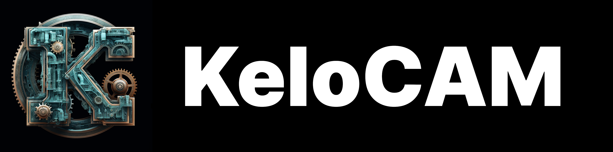

Simple and easy-to-use CAM software for hobbyists and semi-professionals

 

## About this Project

KeloCAM is CNC/CAM software written to make CNC routing and milling more approachable to the average user. It was written in [Rust](https://rust-lang.org) using the new [WebGPU](https://wgpu.rs) technology. The UI code is provided by [egui](https://egui.rs), a robust intermediate UI framework.

 

## What We have Today

Since KeloCAM is in very-very-early stages it is lacking a ton of essential features and is basically unuseable. It should not be used in any production environment. Parts that are finished include
- The editor UI base

 

## Planned Features

1. Easy-to-use Toolpath generation.
2. Drag and Drop STL files.
3. Support many different CNCs.
4. Preview Toolpath before executing.
5. Monitor the CNC process.

 

## Credits

- [Pyae Sone Myo](https://github.com/Rickaym) for providing the [logo](logo.png) and rights to use this image, which was generated by Midjourney AI.

 

[LICENSE](LICENSE) | &copy; [Lucas Birkert](https://lbirkert.com) 2023
